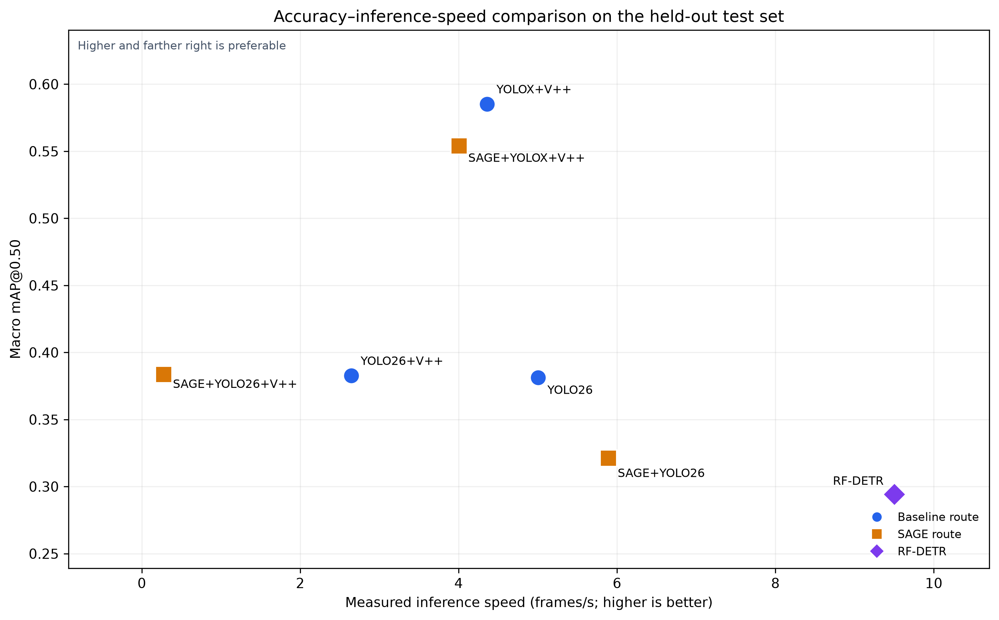
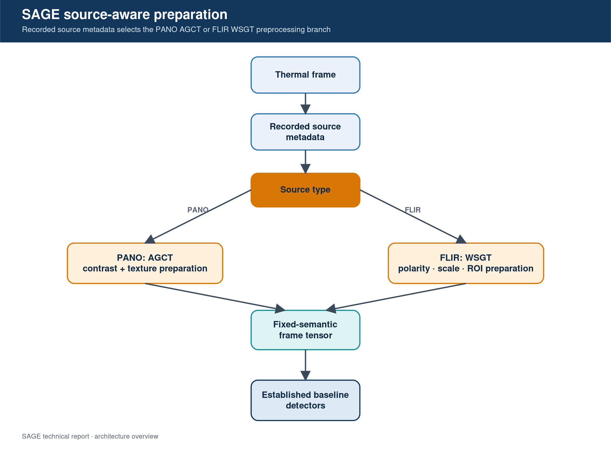
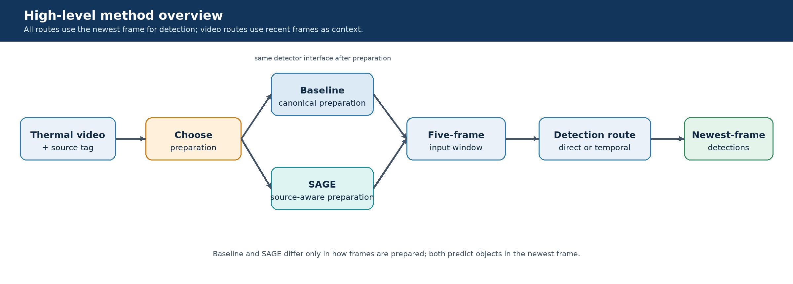
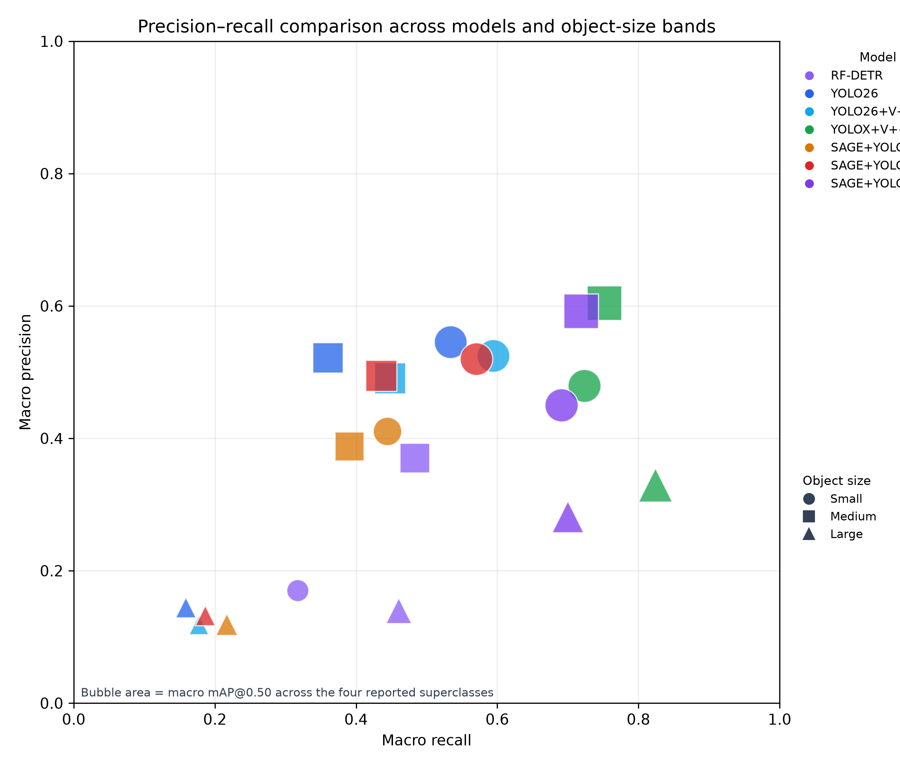

# SAGE Source Aware Multiframe Thermal Detection

SAGE is a source-aware preparation method for causal multiframe thermal object detection in coastal surveillance. It addresses a practical mismatch: panoramic thermal cameras and forward-looking infrared cameras produce different target appearances, clutter patterns, polarity behaviour, and scale distributions, yet an operational detector may need to support both through one stable interface.

This repository is a public, documentation-only release. It contains the technical report, architecture diagrams, result charts, and reported evaluation tables. It does not contain source code, model weights, training data, test imagery, or deployment configuration.

## What is novel

SAGE uses recorded camera-source metadata to select one of two preparation branches before detection:

- **AGCT for PANO:** Adaptive Gated Contrast Tensor uses robust whole-frame contrast and entropy statistics to decide how strongly to apply local contrast enhancement.
- **WSGT for FLIR:** Whole-scene and Scale-Gated Glint Tensor uses a polarity-invariant local response, whole-scene compatibility, and scale guidance to handle both white-hot and black-hot imagery.
- **One fixed detector interface:** Both branches return the same ordered three-channel representation: the original-looking intensity view, an enhanced or polarity-normalised view, and a source-specific cue map.
- **Causal multiframe operation:** Five chronological frames from `t-4` through `t` are combined into a 15-channel input. Only the newest frame is predicted, and no future frames are used.

The source tag controls deterministic routing only; it is not supplied to the detector as a learned feature. SAGE changes frame preparation while preserving labels, detector architecture, split manifest, post-processing, and threshold selection within each matched comparison.

## How the study works

The evaluation uses three matched baseline/SAGE pairs:

| Pair | Baseline | SAGE condition | Question |
|---|---|---|---|
| P1 | YOLO26-P2 | SAGE + YOLO26-P2 | Does source-aware preparation add value to direct multiframe detection? |
| P2 | YOLO26-P2 + YOLOV++ | SAGE + YOLO26-P2 + YOLOV++ | Does SAGE add value after temporal feature aggregation? |
| P3 | YOLOX + YOLOV++ | SAGE + YOLOX + YOLOV++ | Does the effect persist with a different spatial detector? |

RF-DETR is included as a single-frame open-source comparator. The six baseline/SAGE conditions use causal video input and predict the newest frame only.

## Evaluation protocol

- Frozen held-out test set of 542 clips.
- Validation selects checkpoints, operating thresholds, and confidence thresholds before held-out testing.
- Results disclose four approved superclasses: Boat, Person, Swimmer, and Buoy.
- All matched baseline/SAGE comparisons use the same data, labels, timing, image-size policy, and post-processing.
- Speed is CUDA-synchronised model inference plus superclass non-maximum suppression on an NVIDIA RTX A6000, excluding image loading and preprocessing.
- Size bands follow COCO object-area ranges: Small below 32 squared pixels, Medium from 32 squared to below 96 squared pixels, and Large at or above 96 squared pixels.

## Main results

Held-out superclass average precision:

| Model | Boat mAP50 | Person mAP50 | Swimmer mAP50 | Buoy mAP50 |
|---|---:|---:|---:|---:|
| RF-DETR | 0.630 | 0.565 | 0.511 | 0.133 |
| YOLO26-P2 | 0.603 | 0.319 | 0.693 | 0.295 |
| YOLO26-P2 + YOLOV++ | 0.574 | 0.396 | 0.678 | 0.247 |
| **YOLOX + YOLOV++** | **0.884** | **0.866** | **0.959** | **0.537** |
| SAGE + YOLO26-P2 | 0.528 | 0.450 | 0.500 | 0.145 |
| SAGE + YOLO26-P2 + YOLOV++ | 0.572 | 0.388 | 0.677 | 0.257 |
| SAGE + YOLOX + YOLOV++ | 0.835 | 0.764 | 0.576 | 0.518 |

The central result is architecture-dependent:

- YOLOX + YOLOV++ is strongest across all four reported superclasses.
- Direct SAGE + YOLO26-P2 improves Person mAP50 by 0.131, from 0.319 to 0.450, but reduces Boat, Swimmer, and Buoy performance.
- The YOLO26-P2 temporal matched pair is effectively neutral.
- SAGE + YOLOX + YOLOV++ is lower than its matched baseline on every reported superclass.

These results do not establish SAGE as a universal accuracy improvement. They support a controlled source-aware representation whose benefit depends on the detector architecture and target regime. Source-stratified AGCT/WSGT ablations and complete-event operational trials remain necessary.

## Repository contents

- [`SAGE_Technical_Report.pdf`](SAGE_Technical_Report.pdf) - full technical report, methods, protocol, tables, discussion, and references.
- [`figures/`](figures/) - SAGE, study, detector architecture, and results graphics.
- [`results/superclass_results.csv`](results/superclass_results.csv) - held-out superclass mAP50 and mAP50:95 values.
- [`results/size_stratified_results.csv`](results/size_stratified_results.csv) - held-out size-stratified mAP50 and inference speed.

## Scope and limitations

This release includes quantitative held-out results and architecture diagrams. It does not include a systematic visual-error gallery, AGCT-only or WSGT-only ablation results, confidence intervals, source imagery, or operational complete-event trials. Conclusions should remain limited to the documented evaluation.

## Citation

If you use or discuss this work, cite the technical report:

> Haja Amir Rahman. *SAGE: Source-Aware Multiframe Thermal Detection for Coastal Surveillance. Technical Report: Controlled Source-Aware Evaluation.* 2026.

